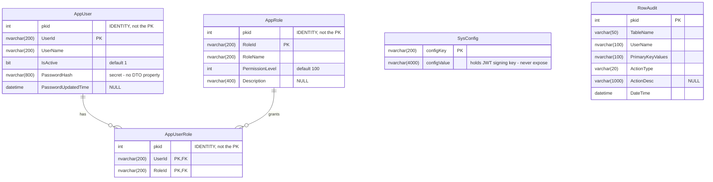
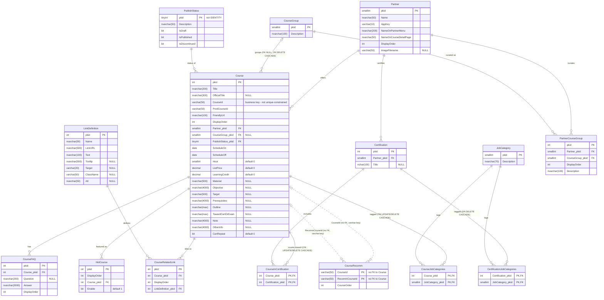
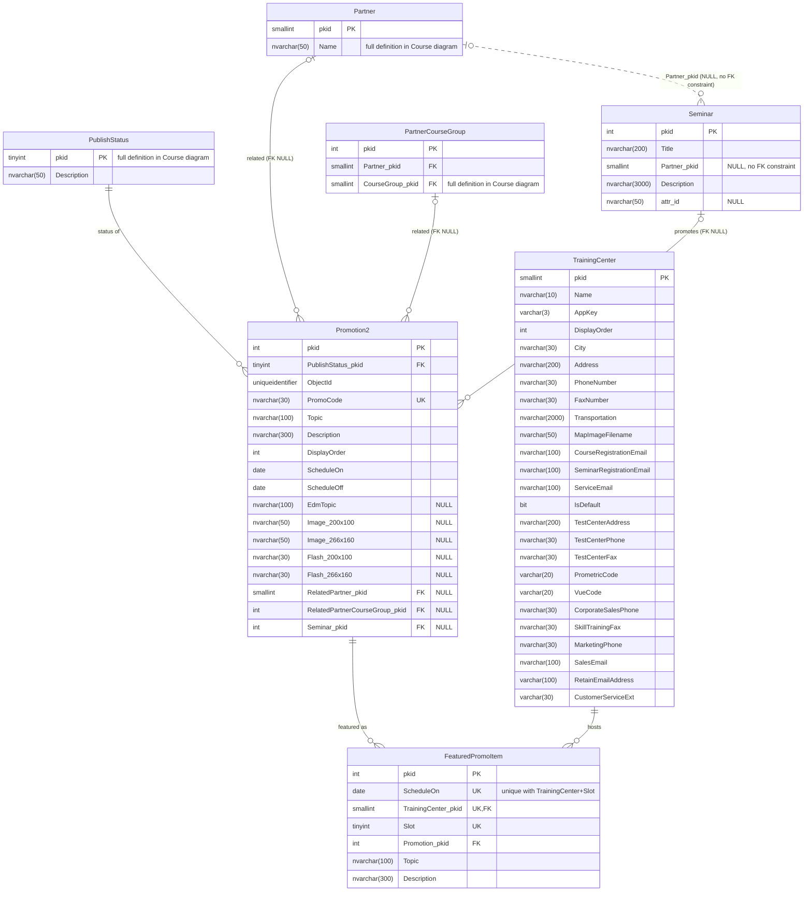

# CMS Database ERD

Generated from the schema scripts in this folder (`admin.sql`, `auth.sql`, `course.sql`,
`promotion.sql`). The `database/*.sql` files are the source of truth — regenerate this diagram when
they change.

Notes on notation:

- Solid lines are declared FK constraints; **dashed lines are logical references with no FK
  constraint** in the schema (`Seminar.Partner_pkid`, `CourseRecomm.CourseId/RecommCourseId`).
- Relationship labels call out `ON DELETE CASCADE` where declared — deleting the parent silently
  deletes those children (no 547 error).
- `AppRole`, `AppUser` and `AppUserRole` have an `IDENTITY` `pkid` column that is **not** the
  primary key; the business key (`RoleId`, `UserId`) is the PK.
- Shared tables (`Partner`, `PartnerCourseGroup`, `PublishStatus`, `TrainingCenter`) appear in more
  than one `.sql` file; they are drawn in full once and abbreviated elsewhere.
- `decimal` column precision omitted: `ListPrice` is `decimal(9,0)`, `LearningCredit` is
  `decimal(9,1)`.

## Auth / Admin (`auth.sql`, `admin.sql`)

`auth.sql` is a subset of `admin.sql` (it lacks `PublishStatus` and `RowAudit`). `SysConfig` and
`RowAudit` have no relationships.

## Course (`course.sql`)

## Promotion (`promotion.sql`)

`Partner`, `PartnerCourseGroup`, `PublishStatus` and `CourseGroup` are the same tables as in the
Course diagram — abbreviated here. `TrainingCenter` (also declared in `course.sql`, unreferenced
there) is drawn in full since this is where it participates in a relationship.

## Cascade summary (affects DELETE confirm text — see CLAUDE.md rule 6)

| Parent | Child | Behavior |
|--------|-------|----------|
| CourseGroup | Course | **ON DELETE CASCADE** — deleting a group silently deletes its courses |
| Course | CourseInCertification | ON UPDATE + ON DELETE CASCADE |
| Course | CourseJobCategories | ON UPDATE + ON DELETE CASCADE |
| Certification | CertificationJobCategories | ON DELETE CASCADE |
| all other FKs | — | NO ACTION — parent DELETE raises error 547 while children exist |
